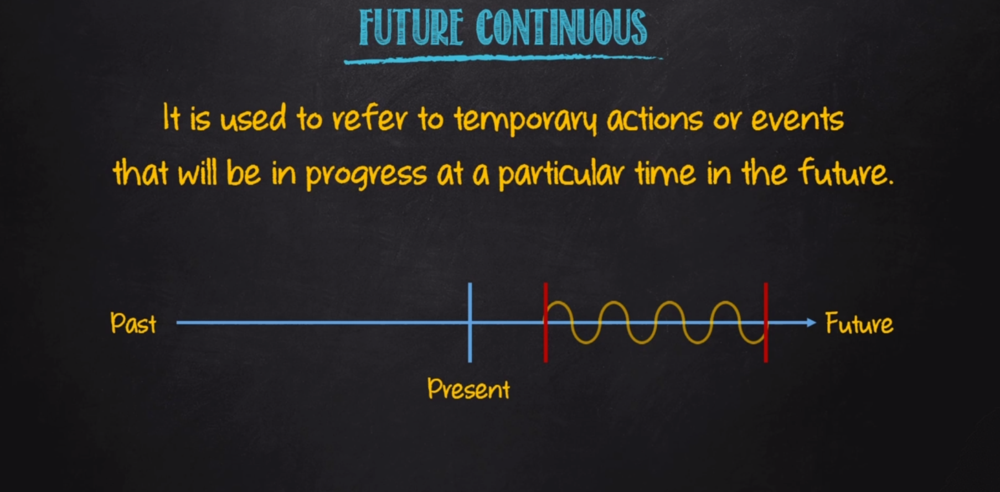

# Future Continuous

| Afirmativo         | Negativo              | Interrogativo        |
|--------------------|-----------------------|----------------------|
| I will (I've) be (verb+ing)| I will not(won't) be (verb+ing) | will I be (verb+ing)?|
| You will (you've) be (verb+ing)| You will not(won't) be (verb+ing) | will you be (verb+ing)?|
| He will (he's) be (verb+ing) | He will not(won't) be (verb+ing)| will he be (verb+ing)?|
| She will (she's) be (verb+ing) | She will not(won't) be (verb+ing) | will she be (verb+ing)?|
| It will (It's) be (verb+ing) | It will not(won't) be (verb+ing) | will it be (verb+ing)?|
| We will (we've) be (verb+ing) | We will not(won't) be (verb+ing) | will we be (verb+ing)?|
| You will (you've) be (verb+ing) | You will not(won't) be (verb+ing) | will you be (verb+ing)?|
| They will (they've) be (verb+ing) | They will not(won't) be (verb+ing) | will they be (verb+ing)?|

## Sentence contruction

- Aff: Sp + will + be + **(main verb + ing)** + complement
  - E.g: Ted will be running a marathon next Saturday
- Neg: Sp + will + not + be + **(main verb + ing)** + complement
  - E.g: Ted will not (won't) be running a marathon next Saturday
- Int: Will + Sp + **be** + **(main verb + ing)**  + complement?
  - E.g: Will Ted be running a marathon next Saturday?

**Exemples:**

- He'll be feeling thirsty after his speech
- This time next week, I'll be taking photographs with my new professional camera
- I'll be studying a lot from now until the day of my College Entrance Exam
- You can visit us during the first week of July. We won't be working then
- Will you be singing in the concert tomorrow night?
