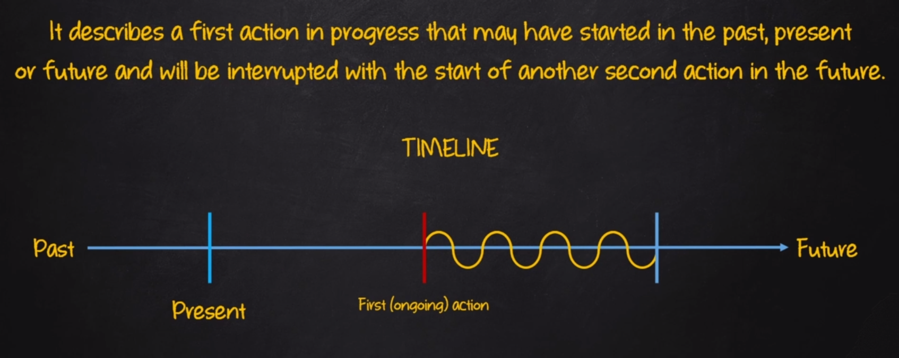

# Future Perfect Continuous

| Afirmativo         | Negativo              | Interrogativo        |
|--------------------|-----------------------|----------------------|
| I will (I'll) have been (verb+ing)| I will not ( won't ) have been (verb+ing) | will I have been (verb+ing)?|
| You will (you'll) have been (verb+ing)| You will not( won't ) have been (verb+ing) | will you have been (verb+ing)?|
| He will (he'll) have been (verb+ing) | He will not ( won't ) have been (verb+ing)| will he have been (verb+ing)?|
| She will (she'll) have been (verb+ing) | She will not ( won't) have been (verb+ing) | will she have been (verb+ing)?|
| It will (It'll) have been (verb+ing) | It will not ( won't) have been (verb+ing) | will it have  been (verb+ing)?|
| We will (we'll) have been (verb+ing) | We will not ( won't ) have been (verb+ing) | will we have been (verb+ing)?|
| You will (you'll) have been (verb+ing) | You will not ( won't ) have been (verb+ing) | will you have been (verb+ing)?|
| They will (they'll) have been (verb+ing) | They will not ( won't ) have been (verb+ing) | will they have been (verb+ing)?|

## Sentence Construction

- AFF: SP + will + have + been + (main verb+ing) + complement
  - E.g: Rose will have been playing drums for twenty years when she turns thirty
- NEG: SP + will + not + have + been + (main verb+ing) + complement
  - E.g: Rose will not have been playing drums for twenty years when she turns thirty
- INT: Will + SP + have + been + (main verb+ing) + complement?
  - E.g: Will Rose have been playing drums for twenty years when she turns thirty?

- E.g:
  - He will have been studying English for three years next month
  - They will not have been working here for very long if they are fired over poor sells
  - She will have been driving for over 8 hours by the times she gets there
  - My son will have been sleeping for twelve hours at 10 pm
  - Will Paul and Toldd have been teaching English for more than 35 years when they retire?
