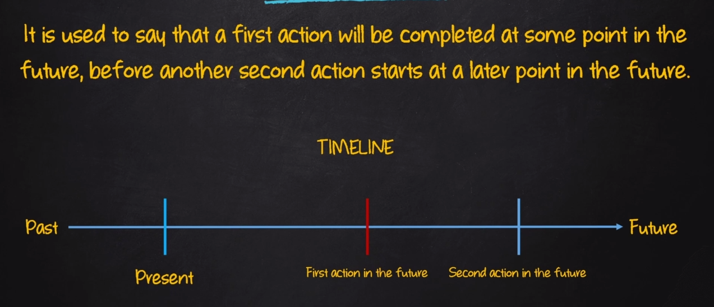
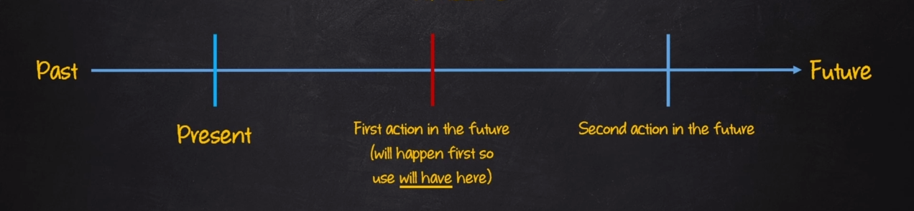

# Future Perfect

| Afirmativo         | Negativo              | Interrogativo        |
|--------------------|-----------------------|----------------------|
| I will (I'll) have verb (p.p)| I will not ( won't ) verb (p.p) | will I have verb (p.p)?|
| You will (you'll) have verb (p.p)| You will not( won't ) verb (p.p) | will you have verb (p.p)?|
| He will (he'll) have verb (p.p) | He will not ( won't ) verb (p.p)| will he have verb (p.p)?|
| She will (she'll) have verb (p.p) | She will not ( won't) verb (p.p) | will she have verb (p.p)?|
| It will (It'll) have verb (p.p) | It will not ( won't) verb (p.p) | will it have  verb (p.p)?|
| We will (we'll) have verb (p.p) | We will not ( won't ) verb (p.p) | will we have verb (p.p)?|
| You will (you'll) have verb (p.p) | You will not ( won't ) verb (p.p) | will you have verb (p.p)?|
| They will (they'll) have verb (p.p) | They will not ( won't ) verb (p.p) | will they have verb (p.p)?|

(p.p) = Past Participle

## Sentence Construction

- AFF: SP + will + have + main verb (past participle) + complement
  - E.g: Tim will have finished his report by the and of the week
- NEG: SP + will + not + have + main verb (past participle) + complement
  - E.g: Tim will not have finished his report by the and of the week
- INT: Will + SP + have + main verb (past participle) + complement?
  - E.g: Will Tim have finished his report by the and of the week?

**Exemples:**

- E.g:
  - I will have already visited ten countries when I travel to France
  - Will they have finished decorating the church before the wedding?
  - Chester will not have arrived by the time the parade is over
  - My kids will have woken up when you pick them up
  - Anna will have lived here for six months on June 23rd
