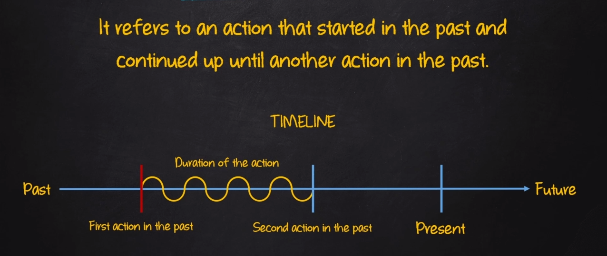
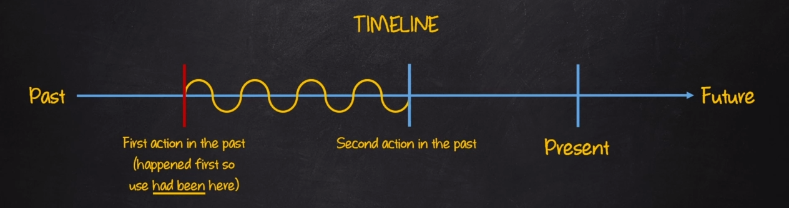

# Past Perfect Continuous

| Afirmativo         | Negativo              | Interrogativo        |
|--------------------|-----------------------|----------------------|
| I had (I'd) been ( verb+ing )| I had not(hadn't) been ( verb+ing ) | had I been ( verb+ing )?|
| You had (you'd) been ( verb+ing )| You had not(hadn't) been ( verb+ing ) | had you been ( verb+ing )?|
| He had (he'd) been ( verb+ing ) | He had not(hadn't) been ( verb+ing )| had he been ( verb+ing )?|
| She had (she'd) been ( verb+ing ) | She had not(hadn't) been ( verb+ing ) | had she been ( verb+ing )?|
| It had (It'd) been ( verb+ing ) | It had not(hadn't) been ( verb+ing ) | had it been ( verb+ing )?|
| We had (we'd) been ( verb+ing ) | We had not(hadn't) been ( verb+ing ) | had we been ( verb+ing )?|
| You had (you'd) been ( verb+ing ) | You had not(hadn't) been ( verb+ing ) | had you been ( verb+ing )?|
| They had (they'd) been ( verb+ing ) | They had not(hadn't) been ( verb+ing ) | had they been ( verb+ing )?|

## Sentence Construction

- AFF: SP + had + been (main verb) + complement
  - E.g: Volet had been waiting at the parking lot for two hours when her husband finally arrived
- NEG: SP + had + not + been (main verb) + complement
  - E.g: Volet had not been waiting at the parking lot for two hours when her husband finally arrived
- INT: Had + SP + been + (main verb) + complement?
  - E.g: Had Volet been waiting at the parking lot for two hours when her husband finally arrived?

**Exemples:**

- E.g:
  - We had been playing soccer when the accident occurred
  - I had not been sleeping when my wife arrived back from work
  - He had only been working there a week before he got fired
  - Had he been waiting a long time before he caught the train
