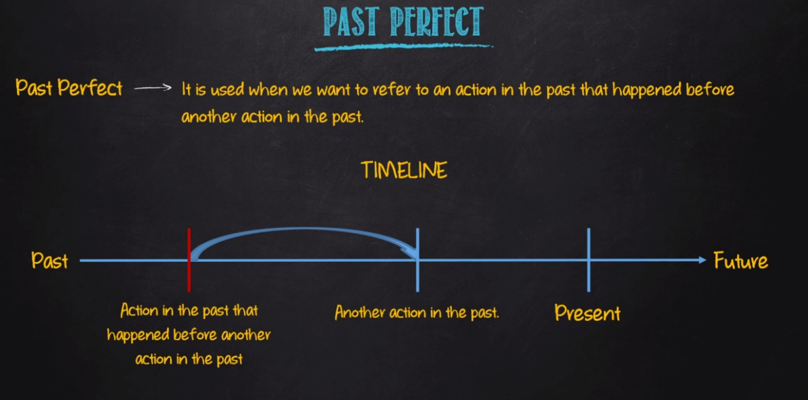
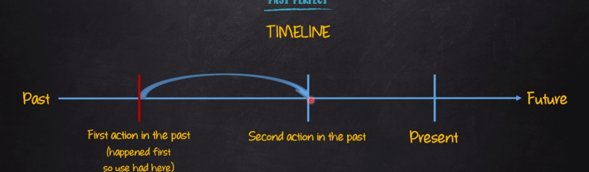

# Past Perfect

| Afirmativo         | Negativo              | Interrogativo        |
|--------------------|-----------------------|----------------------|
| I had (I'd) verb (p.p)| I had not(hadn't) verb (p.p) | had I verb (p.p)?|
| You had (you'd) verb (p.p)| You had not(hadn't) verb (p.p) | had you verb (p.p)?|
| He had (he'd) verb (p.p) | He had not(hadn't) verb (p.p)| had he verb (p.p)?|
| She had (she'd) verb (p.p) | She had not(hadn't) verb (p.p) | had she verb (p.p)?|
| It had (It'd) verb (p.p) | It had not(hadn't) verb (p.p) | had it verb (p.p)?|
| We had (we'd) verb (p.p) | We had not(hadn't) verb (p.p) | had we verb (p.p)?|
| You had (you'd) verb (p.p) | You had not(hadn't) verb (p.p) | had you verb (p.p)?|
| They had (they'd) verb (p.p) | They had not(hadn't) verb (p.p) | had they verb (p.p)?|

(p.p) = Past Participle

## Sentence Construction

- AFF: SP + had + main verb (past participle) + complement
  - E.g: Tyler had met your sister before the meeting
- NEG: SP + had + not + main verb (past participle) + complement
  - E.g: Tyler had not (hadn't) met your sister before the meeting
- INT: Had + SP + main verb (past participle) + complement?
  - E.g: Had Tyler met your sister before the meeting?

**Exemples:**

- E.g:
  - When I arrived at the restaurant, Victoria had already orderred a glass of wine
  - Before Emily moved to another City, she had had a talk with her mother
  - She asked me if had learning the new regulations
  - We had not finished our task when the boss arrived
  - Had Jack fed his hamster before he left his house?
