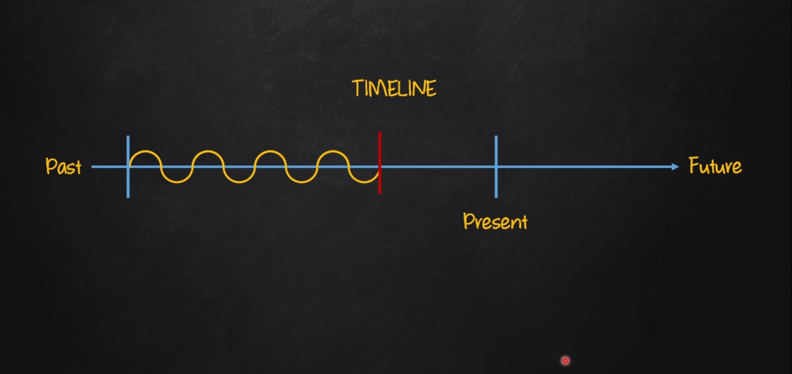

# Past Continuous

| Afirmativo         | Negativo              | Interrogativo        |
|--------------------|-----------------------|----------------------|
| I was **verb + ing**| I was **not verb + ing**| Was I **verb + ing**?|
| You were **verb + ing**| You were **not verb + ing**| Were you **verb + ing**?|
| He was **verb + ing**| He was **not verb + ing**| Was he **verb + ing**?|
| She was **verb + ing**| She was **not verb + ing**| Was she **verb + ing**?|
| It was **verb + ing**| It was **not verb + ing**| Was it **verb + ing**?|
| We were **verb + ing**| We were **not verb + ing** | Were we **verb + ing**?|
| You were **verb + ing**| You were **not verb + ing**| Were you **verb + ing**?|
| They were **verb + ing**| They were **not verb + ing**| Were they **verb + ing**?|

## Sentence contruction

- Aff: Sp + verb to be (in the past) + **(verb + ing)** + complement
  - E.g: He was **watching** TV
- Neg: Sp + verb to be (in the past) + **not** + **(verb + ing)** + complement
  - E.g: He was **not watching** TV
  - (wasn't)
- Int: Verb to be (in the past) + Sp + **(verb + ing)**  + complement?
  - E.g: Was he **watching** TV

## Spelling Rules

- **Rule 1**: Se o verbo terminar em um **e** não tônico (sem ênfase), retire o **e** e adicione o **ing**
  - **E.g**: Leave - **leaving**; take - **talking**; receive - **receiving**;
- **Rule 2**: Em verbos monossílabas terminadas em consoante-vogal-consoante (CVC) dobre a última consoante e adicione **ing**
  - **E.g**: sit - **sitting**; run - **running**; hop - **hopping**;
  - Entretanto, **NÂO DOBRE** a última consoante se ela for um **w,x ou y**
  - **E.g**: sew - **sewing**; fix **fixing**; enjoy - **enjoying**
- **Rule 3**: Para verbos com duas ou mais sílabas, terminadas em consoante-vogal-consoante (CVC), só dobre a última consoante caso a última sílaba seja tônica (com ênfase), e então adicione o **ing**
  - **E.g**: admit - **admitting**; regret - **regretting**
- **Rule 4**: Se o verbo terminar em **ie**, remova o **ie** e adicione **ying**
  - **E.g** die - **dying**; lie - **lying**
- **Rule 5**: Adicione **ing** no final dos verbos que não se enquadrarem em alguma das regras anteriores
  - **E.g**: read - **reading**; stand - **standing**; jump - **jumping**

**Exemples:**

- We were waiting at home all day
- It was raining yesterday
- My son was cleaning his bedroon
- Marry wasn't feeling well today
- He was not studying in the lebrary
- We were not sleeping when you arrived
- Was Ellen drinking coffee in that coffee shop?
- Were they traveling around the world?
- Was Tony complaining about his job?
