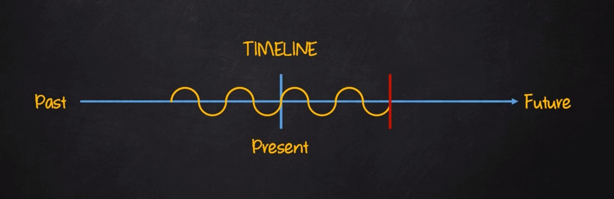

# Present Continuous

| Afirmativo         | Negativo              | Interrogativo        |
|--------------------|-----------------------|----------------------|
| I am **verb + ing**| I am **not verb + ing**| Am I **verb + ing**?|
| You are **verb + ing**| You are **not verb + ing**| Are you **verb + ing**?|
| He is **verb + ing**| He is **not verb + ing**| Is he **verb + ing**?|
| She is **verb + ing**| She is **not verb + ing**| Is she **verb + ing**?|
| It is **verb + ing**| It is **not verb + ing**| Is it **verb + ing**?|
| We are **verb + ing**| We are **not verb + ing** | Are we **verb + ing**?|
| You are **verb + ing**| You are **not verb + ing**| Are you **verb + ing**?|
| They are **verb + ing**| They are **not verb + ing**| Are they **verb + ing**?|

## Sentence contruction

- AFF: SP + verb to be + **(verb + ing)** + complement
  - E.g? He is watching TV
- NEG: SP + verb to be + **not** + **(verb + ing)** + complement
  - E.g? He is **not watching** TV
- INT: verb to be + SP + **(verb + ing)** + complement
  - Is he watching TV?

## SPELLING RULES

- **RULE 1:** Se o verbo terminar em um **"e"** não tônico **(Sem ênfase)**, retire o **"e"** e adicione **"ing"**.
  - E.g: leave - **leaving**; Take - **Taking**; Receive - **Receiving**
- **RULE 2:** Em verbos monossílabas terminadas em consoantes-vogal-consoante **(CVC)**, dobre a última consoante e adicione o **"ing"**.
  - E.g: Sit - **Sitting**; Run - **"Running"**; hop - **"Hopping"**
  - Entretando, **NÂO DOBRE** a última consoante se ela for um **"W" "X" ou "Y"**
  - E.g: sew 9 **"Sewing"**; fix - **"Fixing"**; enjoy - **"Enjoying"**
- **RULE 3:** Para verbos com duas ou mais sílabas, terminadas em consoante-vogal-consoante **(CVC)**, só dobre a última consoante caso a útima consoate ou a última sílaba seja tônica **(com ênfase)**, e então adicione o **"ing"**
  - E.g: admit - **admitting**; regret - **regretting**;
- **RULE 4:** Se o verbo terminar em **"ie"**, removre o **"ie"** e adicione o **"ying"**
  - E.g: die - **dying**; lie - **lying**;
- **Rule 5:** Adicione **"ing"** no final dos verbos que não se enquadrarem em alguma das regras anteriores
  - E.g: read- **reading**; stand - **standing**; jump - **jumping**

***

**Exemples:**

- I'm having problems with my car today
- It's raining
- She's going home now
- You aren't listening or you're not listening
- Marry isn't feeling well today
- The children are not sleeping
- Are they watching TV?
- Is he teaching at any university now?
- Are you studyong for the exams?
