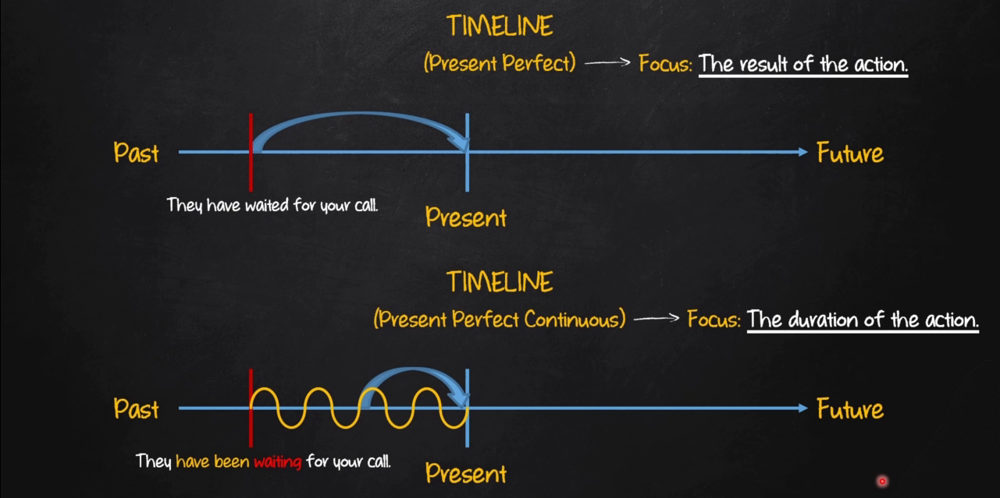

# Present Perfect Continuous

| Afirmativo         | Negativo              | Interrogativo        |
|--------------------|-----------------------|----------------------|
| I have (I've) been (verb+ing)| I have not(havent't) been (verb+ing) | Have I been (verb+ing)?|
| You have (you've) been (verb+ing)| You have not(havent't) been (verb+ing) | Have you been (verb+ing)?|
| He has (he's) been (verb+ing) | He has not(hasnt't) been (verb+ing)| Has he been (verb+ing)?|
| She has (she's) been (verb+ing) | She has not(hasnt't) been (verb+ing) | Has she been (verb+ing)?|
| It has (It's) been (verb+ing) | It has not(hasnt't) been (verb+ing) | Has it been (verb+ing)?|
| We have (we've) been (verb+ing) | We have not(havent't) been (verb+ing) | Have we been (verb+ing)?|
| You have (you've) been (verb+ing) | You have not(havent't) been (verb+ing) | Have you been (verb+ing)?|
| They have (they've) been (verb+ing) | They have not(havent't) been (verb+ing) | Have they been (verb+ing)?|

## Sentence Construction

- AFF: SP + **has/have** + **been** + main verb (ing) + complement
  - E.g: They have been waiting for you call
- NEG: SP + **has/have** + **not** + **been** + main verb (ing) + complement
  - E.g: They have not been waiting for you call
- INT: **Has/Have** + SP + **been** + main verb (ing) + complement
  - E.g: Have they been waiting for you call?

**Exemples:**

- I have washed the car (present perfect)
- I have been washing the car (present perfect continuous)
