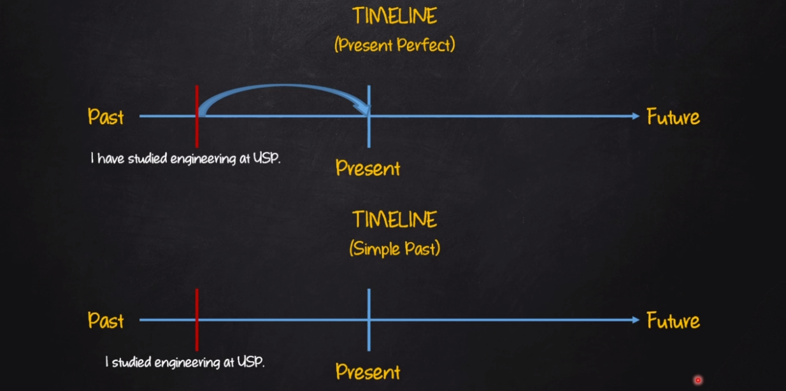

# Present Perfect

| Afirmativo         | Negativo              | Interrogativo        |
|--------------------|-----------------------|----------------------|
| I have (I've) verb (p.p)| I have not(havent't) verb (p.p) | Have I verb (p.p)?|
| You have (you've) verb (p.p)| You have not(havent't) verb (p.p) | Have you verb (p.p)?|
| He has (he's) verb (p.p) | He has not(hasnt't) verb (p.p)| Has he verb (p.p)?|
| She has (she's) verb (p.p) | She has not(hasnt't) verb (p.p) | Has she verb (p.p)?|
| It has (It's) verb (p.p) | It has not(hasnt't) verb (p.p) | Has it verb (p.p)?|
| We have (we've) verb (p.p) | We have not(havent't) verb (p.p) | Have we verb (p.p)?|
| You have (you've) verb (p.p) | You have not(havent't) verb (p.p) | Have you verb (p.p)?|
| They have (they've) verb (p.p) | They have not(havent't) verb (p.p) | Have they verb (p.p)?|

(p.p) = Past Participle

## Sentence Construction

- AFF: SP + **has/have** + main verb (past participle) + complement
  - E.g: You have studied engineering at USP
- NEG: SP + **has/have** + **not** + main verb (past participle) + complement
  - E.g: You have not (haven't) studied engineering at USP
- INT: **Has/Have** + SP + main verb (past participle) + complement
  - E.g: Have you studied engineering at USP?

**Exemples:**

- I can't get in the house. I've lost my keys
- Teresa isn't at home. I think she has traveled with her parents
- They have not delivered the documents we need to finish our job
- She's hurt her leg so she can't play tennis today
- Has he slept last night? He doesn't look so well

**OBS:**

- Has/Have (been): It means that the person/people has/home return
  - E.g: Tom: Where have you been?
  - Sue: I've just been out to the supermarket. (Now, Sue is back)

- Has/Have gone: It means that the person/people has/home not returned
  - E.g: Alice: Where's Mary?
  - James: She's gone to Paris. She'll be back next week. (Mary is in Paris now)
