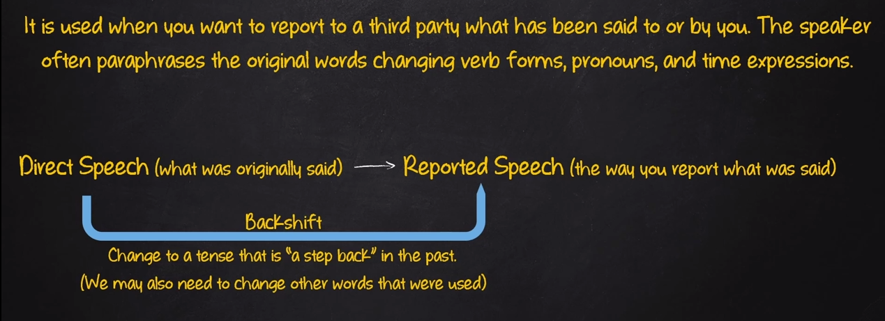

# Reported Speech

## Sentence Construction

Report Clause (with or without a conjunction) + Reported Statement

- E.g:
  - Direct Speech: Carl - I want to talk to Mary
  - Reported Speech: You - Carl said (that) he wanted to talk to Mary

|Direct Speech|Reported Speech|
|-------------|---------------|
|**Simple Present**|**Simple Past**|
|I like coffee|He said (that) he like coffee|
|**Present Continuous**| **Past Continuous**|
|I am living in California|He said (that) he was living in California|
|**Simple Past**|**Simple Past or Past Perfect**|
|I went to the doctor|He said (that) he went to the doctor|
|**PAst Continuous**|**Past Continuous or Past Perfect Continuous**|
|I was working alone|He said (that) he was working alone|
|**Will**|**Would**|
|I will study hard|He said (that) he would study hard|
|**Can**|**Could**|
|I can see very well at night| He said (that) he could see very well at night|
|**Could**|**Could**|
|I could easily touch my feet| He said (that) he could easily touch his feet|
|**May (pissibility)**|**Might**|
|I may travel alone| He said (that) he might travel alone|
|**May (permission)**|**Could**|
|You may wait outside|He said (that) I could wait outside|
|**Might**|**Might**|
|It might rain|He said (that) it might rain|
|**Must (abligation)**|**Had to**|
|I must be on time|He said (that) he had to be on time|
|**Must (deduction/conclusion)**|**Must**|
|It must be good to be king|He said (that) be good to be king|
|**Should**|**Should**|
|I should study more|He said (that) he should study more|
|**Would**|**Would**|
|I would be happy in a big house|He said (that) he would be happy in a big house|
|**Shall**|**Would**|
|I shall overcome my limitations|He said (that) be woukd overcome his limitations|
|**Shall (in questions)**|**Should**|
|Shall I open it?| He asked if he should open it|
|**Ought to**|**Ought to**|
|I ought to eat less to reduce my weight|He said (that) be ought eat less to reduce his weight|
|**Present Perfect**|**Past Perfect**|
|I have changed my address|He said (that) he had changed his address|
|**Present Perfect Continuous**|**Past Perfect Continuous**|
|I have been working hard|He said (that) he had been working hard|
|**Future Continuous**|**Would**|
|I will be learning English|He said (that) he would be learning English|
|**Past Perfect**|**Past Perfect**|
|I had eaten before the game|He said (that) he had eaten before the game|
|**Past Perfect Continuous**|**Past Perfect Continuous**|
|I had been working for hours|He said (that) had been working for hours|
|**Future Perfect**|**Would**|
|I will have worked hard|He said (that) he would have worked hard|
|**Future Perfect Continuous**|**Would**|
|I will have been working hard|He said (that) he would have been working hard|

OBS: if what we want to report is still true or relevant, it is not always necessary to change the bern tense

- E.g:
  - Helen (to John): I have broked my arm!
  - John (reporting later): Helen said she has broken her arm, so she won't be at work thiss week
