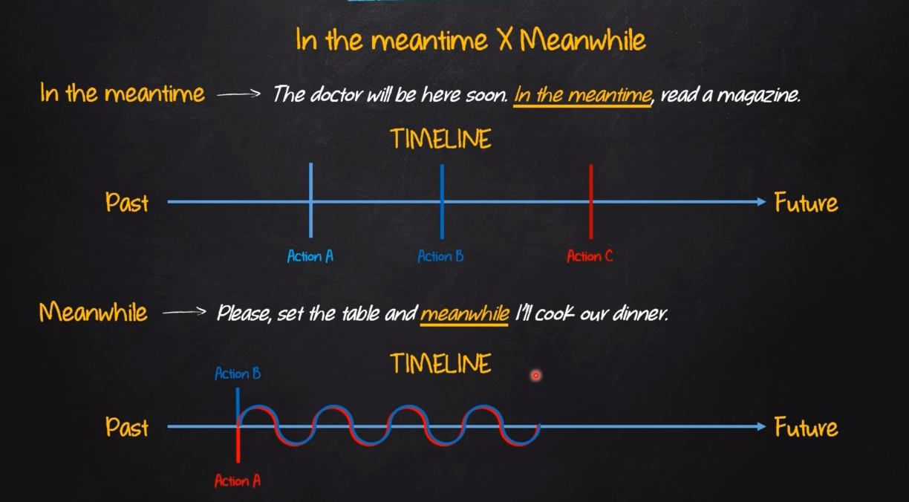

# Time Expressions in Narratives

- **After that**: After something is done
  - E.g: We reviewed the entire process **after that** we presented our solution
- **Afterwords**: At a later time; subsequently
  - E.g: Travel and see the world **afterwords** you will have a better perspective about everything
- **As of**: It indicates the time or date from which something staris
  - E.g: All prices will go up **as of** next month
- **As soon as**: It indicates that something will happen immediately after something else has happened
  - E.g: My plants revired **as soon as** i gave them some water
- **At the and(of)**: The end point of a period of time
  - E.g: i pay the phone bill **at the end of** each month
- **At the time(of)**: A particular moment or period in the past when something happened, especially when the situation is very different now
  - E.g: Mary was not with her husband and sons **at the time of** the accident
- **Before**: It indicates an action that heppens earlier than another action
  - E.g: Our kids will not be back **before** we het home
- **By**: Before or not later than on event
  - E.g: The report will be ready **by** Monday
- **By the time**: Not later than a specific time in the past or in the future
  - E.g: I'll have the financial reports ready **by the time** you get here
- **During**: At the some time with some other action
  - E.g: I heard Tom **snoring** during the classs
- **Eventually**: In the end, especially after a long delay or series of problems
  - E.g: I looked everywhere for my keys, and **eventually** i found them inside one of my shoes
- **In the end**: The final result of a series of events, or the final conclusion after considering all the relevant facts
  - e.g: **In the end**, your fighter's physical strenght surpessed my fighter's agility
- **In the meantime**: The period of time between two past or two future events
  - E.g: The doctor will be here soon, **In the meantime**, read a magazine
- **Meanwhile**: Use while something else is happening.
  - E.g; Please, set the table and **meanwhile** I'll cook our dinner

- **Not to be long until**: A short period of time until something happens
  - E.g: It will **not to be long until** her lies come out
- **Of late**: Recently
  - E.g: Traffic accidents are remarkebly high **of late**
- **Once upon a time**: It indicates that something happened or existed a long time ago
  - E.g: I watched this movie **once upon a time**, so I can't remember the details
- **So far**: up to the present moment
  - E.g: He faces the thoughest test of his leadership **so far**
- **Soon/Shortly after**: After a short period of time
  - E.g: She will leave the hospital **soon** / Order was restored **shortly after** 3 a.m
- **Then**: After on event/action
  - E.g: I'll go to the gym and **then** I'll take a shower
- **Way off in the future**: In a very distant future
  - E.g: Artificial blood cells are **way off in the future**
- **When**: At time/moment that
  - E.g: Where were you on the night **when** the crime took place?
- **While**: During the some time/moment of another event
  - E.g: Nothing much changed **while** he was away
  