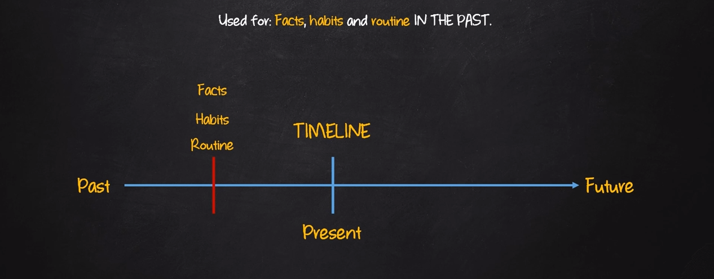

# SIMPLE PAST

| Afirmativo         | Negativo              | Interrogativo        |
|--------------------|-----------------------|----------------------|
| I **was** | I **was not** **(wasn't)** | **was** I ?|
| You **were**| You  **were not** **(were't)** | **were** You ?|
| He **was**| He **was not** **(wasn't)** | **was** He ?|
| She **was**| She **was not** **(wasn't)** | **was** She ?|
| It **was**| It **was not** **(wasn't)**|**was** It ?|
| We **were**| We **were not** **(were't)** | **were** We ?|
| You **were**| You **were not** **(were't)** | **were** You ?|
| They **were**| They **were not** **(were't)** | **were** They ?|

## Sentence contruction

- AFF: SP + **was / were** complement
  - E.g: He was my friend
- NEG: SP + **was / were + not** + complement
  - E.g: He was not my friend
- INT: **was / were** + SP + complement
  - E.g: Was he your firend ?

**Exemples:**

- I was in South Korea last month
- She was late for the exam
- It was a sonny and hot day today
- Mozar wasn't from Germany
- I was tired this morning
- He was my boss ten years ago
- Were you at home last night
- She was my best friend
- They were happy with their test results
- Was he the best in is class
- Were your parents a happy couple?
- My doughter was not a troubled teen
