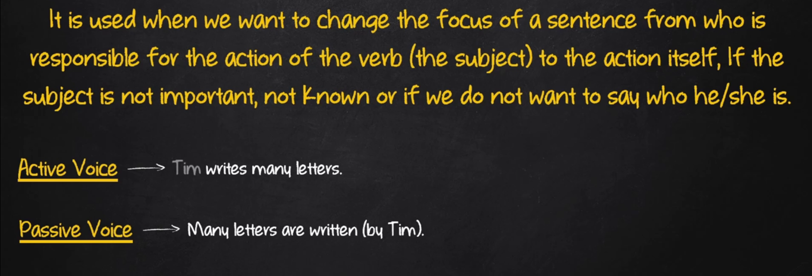

# Passive Voice

## Sentence Constructions

Subject (object in the active voice) + auxiliary verb (if there is one in the active voice) + verb to be (in the same conjugation of the main verb in the active voice) + main verb (past participle) + by agent ( subject in the active voice - optional)

**Subject - Auxiliary Verb - Main Verb - Conjugation of the Main Verb - Object**

**Exemples:**

- Simple Present
  - Tim writes many letters
  - P.V.: Many letters are writting (by Tim)
- Present Continuous
  - Tim is writting many letters
  - P.V.: Many letters are being written (by Tim)
- Simple Past
  - Tim wrote many latters
  - P.V.: Many letters were written (by Tim)
- Past Continuous
  - Tim was writting many letters
  - P.V.: Many letters were being written (by Tim)
- Modal Verbs
  - Tim will write many letters
  - P.V.: Many letters will be written (by Tim)
- Present Perfect
  - Tim has written many letters
  - P.V.: Many letters have been written (by Tim)
- Present Perfect Continuous
  - Tim has been writing many letters
  - P.V.: Many letters have been being written (by Tim)
- Future Continuous
  - Tim will be writing many letters
  - P.V.: Many letters will be being written (by Tim)
- Modal Verbs + Perfect Infinitive
  - Tim could have written many letters
  - P.V.: Many letters could have been written (by Tim)
- Past Perfect
  - Tim had written many letters
  - P.V.: Many letters had been written (by Tim)
- Past Perfect Continuous
  - Tim had been writing many letters
  - P.V.: Many letters had been being written (by Tim)
- Future Perfect
  - Tim will have written many letters
  - P.V.: Many letters will have been written (by Tim)
- Future Perfect Continuous
  - Tim will have been writing many letters
  - P.V.: Many letters will have been being written (by Tim)
